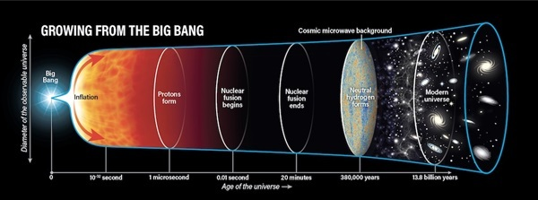

# No sharing

> Work in progress, just for fun. Feedback and contributions welcome!

A brain-inspired topographic vision model without weight sharing.

Popular vision models like convnets and transformers use weight sharing to conserve parameters and add inductive bias. However, strict weight sharing is biologically implausible. Here, we instead aim to *learn* to share weights by promoting local connections and smooth representation maps over a grid of feature columns.

A goal of this work is to explore how topographic visual representations can emerge during learning. Two hallmarks of the primate visual system are retinotopy in early visual cortex and category selectivity in higher visual areas. Arguably, today's standard architectures are unable to fully model this emergent specialization. Strict weight sharing guarantees a uniform representation map at each layer of the network. By promoting smooth but not necessarily uniform representations, we may start to see regional specialization emerge.

Something kind of like this, but replace time with network depth.

## Inspiration

Geoff Hinton. [The Robot Brains Season 2 Episode 22.](https://www.therobotbrains.ai/geoff-hinton-transcript-part-one) (2022).

Doshi, Fenil R., and Talia Konkle. [Cortical topographic motifs emerge in a self-organized map of object space.](https://doi.org/10.1126/sciadv.ade8187) Science Advances (2023).

Margalit, Eshed, et al. [A Unifying Principle for the Functional Organization of Visual Cortex.](https://www.biorxiv.org/content/10.1101/2023.05.18.541361v1) bioRxiv (2023).

Pogodin, Roman, et al. [Towards biologically plausible convolutional networks.](https://proceedings.neurips.cc/paper/2021/hash/746b02b6680562f44ad7526675bac026-Abstract.html) NeurIPS (2021).

Xiong, Yuwen, Mengye Ren, and Raquel Urtasun. [Loco: Local contrastive representation learning.](https://proceedings.neurips.cc/paper/2020/hash/7fa215c9efebb3811a7ef58409907899-Abstract.html) NeurIPS (2020).
